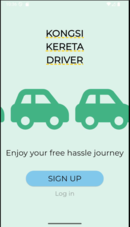
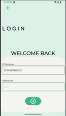
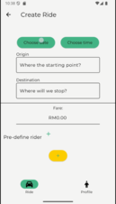
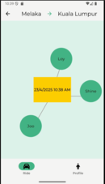

# Worldskill Malaysia Belia 2024 TRAINING

Kongsi Kereta is an eco-friendly ride-sharing app developed for training purposes, aiming to promote sustainability through carpooling. Similar to Grab, it connects riders with drivers—but with a unique twist: it focuses entirely on green, shared transportation to help reduce traffic congestion and lower carbon emissions.

Built using Firebase for real-time updates and secure user management, the app provides a smooth, scalable, and efficient user experience. The calming, nature-themed UI reflects the app’s core mission of encouraging eco-conscious travel and supporting a cleaner, greener future.

## Demo Video

🎵🎵 Mort Garson - Concerto for Philodendron & Pothos

https://github.com/user-attachments/assets/eb5614c2-b4ef-4f70-8246-ecc80d3e0e5f

